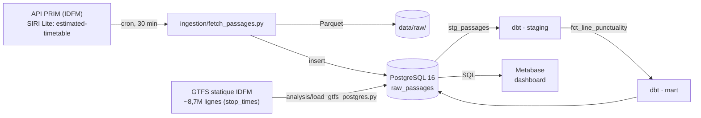
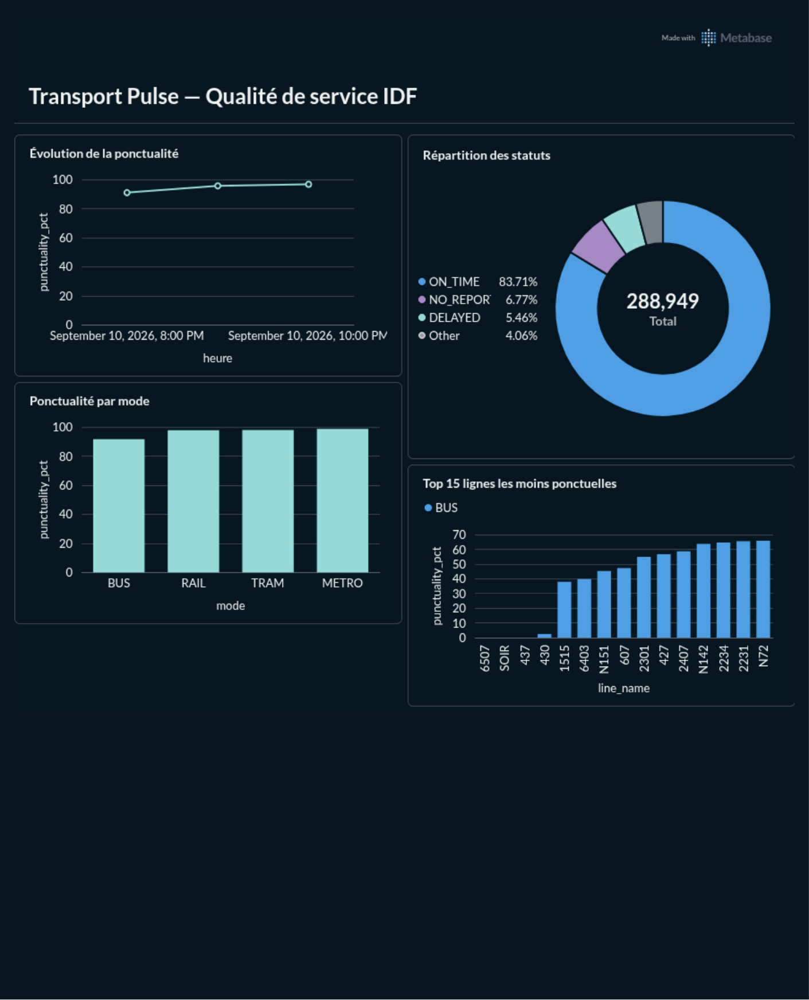

# Transport Pulse — Qualité de service des transports en commun d'Île-de-France

## 📌 Description

Transport Pulse est un pipeline de data engineering qui collecte en continu les passages
temps réel des bus, RER/trains, tramways et métros d'Île-de-France (API PRIM,
Île-de-France Mobilités) et les transforme en indicateurs de ponctualité exploitables dans
un dashboard Metabase. Le pipeline couvre toute la chaîne : ingestion, stockage, tests de
qualité et restitution. Construit comme projet de portfolio dans le cadre d'une recherche
de stage en data engineering.

## 🎯 Problème métier

L'API PRIM expose un flux temps réel des passages aux arrêts (SIRI Lite), mais aucun
indicateur de ponctualité prêt à l'emploi : il faut le croiser avec les horaires
théoriques (GTFS statique) et le structurer par ligne, par mode et dans le temps pour
savoir où le réseau tient — ou non — ses engagements. Transport Pulse automatise cette
chaîne, de la collecte au dashboard.

## 🏗️ Architecture



1. **Ingestion** (`ingestion/fetch_passages.py`) — appelle toutes les 30 min (cron)
   l'endpoint SIRI Lite `estimated-timetable` (toutes lignes, `LineRef=ALL`), aplatit la
   réponse SIRI imbriquée en lignes tabulaires, puis écrit en Parquet (`data/raw/`) et
   insère dans PostgreSQL (`raw_passages`).
2. **Référentiel statique** (`analysis/load_gtfs_postgres.py`) — charge le GTFS IDFM dans
   PostgreSQL : tables de référence en une fois, `stop_times.txt` (737 Mo, ~8,7M lignes)
   par lots de 500 000 lignes.
3. **Transformation dbt** — `stg_passages` (staging, typage + normalisation) puis
   `fct_line_punctuality` (mart, KPI de ponctualité), avec tests dbt (`not_null`,
   `accepted_values`, `dbt_utils.expression_is_true`).
4. **Restitution** — dashboard Metabase branché directement sur PostgreSQL.

## 🛠️ Stack technique

| Composant        | Technologie                                      |
|-------------------|---------------------------------------------------|
| Langage           | Python 3.12                                       |
| Ingestion         | requests, pandas, pyarrow, python-dotenv          |
| Stockage          | PostgreSQL 16, fichiers Parquet                   |
| Transformation    | dbt-postgres (staging + mart, tests, dbt_utils)   |
| Orchestration     | cron                                               |
| Visualisation     | Metabase                                           |
| Conteneurisation  | Docker Compose                                     |

## 📁 Structure du repo

```
transport-pulse-idfm/
├── README.md
├── requirements.txt
├── .gitignore
├── .env.example
├── docker-compose.yml
├── ingestion/
│   └── fetch_passages.py         # collecte SIRI Lite -> Parquet + Postgres
├── analysis/
│   ├── load_gtfs_postgres.py     # chargement chunké du GTFS statique
│   └── delay_prototype.py        # prototype de calcul de retard (merge_asof)
├── dbt/
│   └── transport_pulse/
│       ├── dbt_project.yml
│       ├── packages.yml
│       ├── package-lock.yml
│       ├── profiles.yml.example  # ⚠️ ajouté, voir "Installation" étape 4
│       └── models/
│           ├── staging/
│           │   ├── sources.yml
│           │   ├── schema.yml
│           │   └── stg_passages.sql
│           └── marts/            # ⚠️ déplacé ici, voir docs/architecture.md
│               ├── schema.yml
│               └── fct_line_punctuality.sql
└── docs/
    ├── architecture.md
    └── img/
        └── dashboard-metabase.png
```

## 🚀 Installation et lancement (~15 min, hors téléchargement du GTFS)

**Prérequis** : Docker, Docker Compose, Python 3.12, une clé API sur
[prim.iledefrance-mobilites.fr](https://prim.iledefrance-mobilites.fr/).

1. **Cloner et configurer l'environnement**
   ```bash
   git clone https://github.com/DmxFr/transport-pulse-idfm.git
   cd transport-pulse-idfm
   cp .env.example .env          # renseigner IDFM_API_KEY, POSTGRES_USER, POSTGRES_PASSWORD
   python3 -m venv .venv && source .venv/bin/activate
   pip install -r requirements.txt
   ```

2. **Démarrer PostgreSQL et Metabase**
   ```bash
   docker compose up -d
   ```

3. **Charger le référentiel GTFS statique**
   ```bash
   # télécharger le GTFS IDFM depuis le portail open data d'Île-de-France Mobilités
   # et décompresser son contenu dans data/gtfs/, puis :
   python3 analysis/load_gtfs_postgres.py
   ```

4. **Configurer le profil dbt et builder les modèles**
   ```bash
   cp dbt/transport_pulse/profiles.yml.example dbt/transport_pulse/profiles.yml
   export DBT_PROFILES_DIR=$(pwd)/dbt/transport_pulse
   cd dbt/transport_pulse && dbt deps && dbt run && dbt test
   cd ../..
   ```

5. **Lancer l'ingestion temps réel**
   ```bash
   python3 ingestion/fetch_passages.py     # test manuel, depuis la racine du repo
   # puis en continu (crontab -e) :
   # */30 * * * * cd /chemin/vers/transport-pulse-idfm && .venv/bin/python ingestion/fetch_passages.py >> logs/ingestion.log 2>&1
   ```

6. **Dashboard** → [http://localhost:3000](http://localhost:3000) (Metabase, port
   configurable via `METABASE_PORT`).

## 📊 Exemples de KPI produits



Sur un échantillon de 288 949 passages collectés :
- **83,7 %** de ponctualité globale, 5,5 % de retards, 6,8 % de passages sans remontée
  temps réel.
- Ponctualité par mode : métro et tramway ≈ 98-99 %, RER/train ≈ 98 %, bus ≈ 92 % — le bus
  reste structurellement le mode le plus exposé aux aléas de circulation.
- Le classement des lignes les moins ponctuelles est très majoritairement composé de
  lignes de bus, avec des taux allant de quelques % à ~65 %, loin de la moyenne réseau.

## 📉 Limitations connues et pistes d'évolution

- **Le rapprochement horaire théorique / temps réel n'est pas encore industrialisé en
  dbt.** `models/staging/sources.yml` déclare déjà les sources GTFS (`routes`, `trips`,
  `stop_times`, `stops`), mais seul le prototype Python (`delay_prototype.py`), limité à
  une ligne (bus 64), calcule aujourd'hui les retards. Généraliser cette logique en
  modèles dbt (staging GTFS + mart de retard par ligne) est la suite naturelle du projet.
- **Le prototype ne gère pas le dépassement GTFS >24h** : un service de nuit programmé à
  25h30 ne sera pas correctement rapproché d'un passage réel après minuit (détail dans
  `docs/architecture.md`).
- **Rétention des données** : aucune purge automatique des Parquet ni des tables
  PostgreSQL — une politique de rétention, voire un passage sur **BigQuery** pour
  l'historisation long terme, serait nécessaire pour un usage prolongé.
- **Orchestration par cron** : pas de retry ni d'alerting en cas d'échec. On observe
  d'ailleurs des trous dans l'historique de collecte (un écart de 4h30 entre deux
  snapshots a été relevé lors du nettoyage) — une migration vers **Airflow** apporterait
  résilience et visibilité sur les exécutions.
- **Régularité vs ponctualité** : le pipeline mesure l'écart à l'horaire théorique, pas la
  régularité des lignes à fréquence élevée (métro, RER), où l'intervalle entre deux
  passages est un KPI plus pertinent que l'heure de passage.

## 📄 Licence

Non définie 
